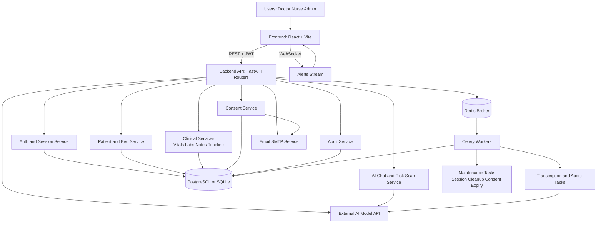
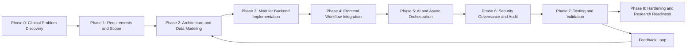
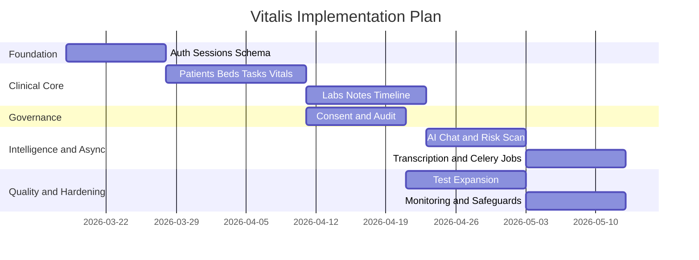

# Vitalis Methodology

## 1. Purpose
This document defines the methodology used to design, build, validate, and harden Vitalis as a patient-centric, governance-aware IPD platform with AI-assisted support.

## 2. Methodology Overview
The project follows an iterative, evidence-driven methodology with continuous feedback loops between design, implementation, and validation.

### 2.1 Methodological Principles
1. Clinical-first modeling
- Data entities and workflows are modeled around bedside decision moments, not around generic CRUD screens.

2. Governance-by-design
- Consent, RBAC, and auditability are implemented as first-class constraints in workflow design, not post-hoc controls.

3. Modular incremental delivery
- Features are delivered by bounded domains (auth, patient, clinical stream, consent, AI, async) to reduce coupling and risk.

4. Evidence over assumptions
- Every major workflow is validated by scenario tests and explicit exit criteria before progressing.

5. Human-in-the-loop AI
- AI output is constrained, contextual, and assistive; final decisions remain clinician-owned.

### 2.2 Research Methodology Lens
The implementation aligns with design science research:
- Artifact: working IPD platform prototype.
- Relevance cycle: grounded in real inpatient workflow pain points.
- Rigor cycle: software architecture patterns, test-backed validation, and measurable outcomes.
- Design cycle: iterative build-measure-learn loops with risk controls.

## 3. System Architecture Diagram

### 3.1 Architecture Layer Responsibilities
1. Experience layer (React)
- Handles role-gated navigation, patient context views, and interaction continuity.
- Performs token-aware API interactions with refresh fallback and session-aware logout.

2. Application layer (FastAPI routers)
- Organizes business capabilities by domain.
- Enforces authorization and validation at endpoint boundaries.

3. Domain and persistence layer (SQLAlchemy + DB)
- Maintains normalized patient-centric entities and event streams.
- Supports traceable state transitions for consent and session lifecycle.

4. Async orchestration layer (Celery + Redis)
- Offloads long-running workloads (transcription, cleanup) from interactive request paths.
- Preserves UX responsiveness while providing eventual consistency.

5. Intelligence and integration layer (AI + SMTP)
- Provides contextual AI support, risk hints, and consent communications.
- All external dependencies are wrapped with explicit error handling and fallbacks.

### 3.2 Cross-Cutting Architecture Controls
1. Security controls
- JWT access tokens plus refresh rotation.
- Role-based endpoint dependencies.
- Session revocation and expiry cleanup.

2. Governance controls
- Consent state machine gates high-risk actions.
- Audit logs capture actor, action, entity, and timestamp.

3. Reliability controls
- Queue-based retry model for asynchronous tasks.
- Service-level fallback paths for external AI and email failures.

4. Maintainability controls
- Router-based modularization.
- Migration-managed schema evolution.
- Testable domain contracts through typed schemas.

### 3.3 Key Runtime Data Flows
1. Synchronous clinical interaction
- UI request -> router guard -> service logic -> database update -> UI refresh.

2. Consent-gated audio flow
- Consent verification -> upload acceptance -> async transcription dispatch -> transcript availability update.

3. Contextual AI flow
- Patient context aggregation -> bounded prompt construction -> model inference -> clinician-visible recommendation.

## 4. Methodology Diagram

### 4.1 Phase Objective Detail
1. Phase 0: Clinical problem discovery
- Identify workflow bottlenecks in rounds, documentation, escalation, and handoff.

2. Phase 1: Requirements and scope
- Define in-scope capabilities, role boundaries, and out-of-scope controls.

3. Phase 2: Architecture and data model
- Produce service decomposition, schema blueprint, and workflow state transitions.

4. Phase 3: Modular backend implementation
- Build secured APIs domain-by-domain with migration-backed persistence.

5. Phase 4: Frontend integration
- Build UI flows around patient timeline, tasks, alerts, and clinical artifacts.

6. Phase 5: AI and async orchestration
- Integrate contextual chat, risk scan, and transcription through queue workers.

7. Phase 6: Security, governance, and audit
- Tighten RBAC, consent checks, session hygiene, and audit completeness.

8. Phase 7: Test and validate
- Execute scenario-based tests and edge-case verification.

9. Phase 8: Hardening and readiness
- Define monitoring, rate limiting, pagination strategy, and operational playbooks.

## 5. Implementation Plan

### 5.1 Workstreams
1. Platform Foundation
- Auth, RBAC, session lifecycle, schema migrations.

2. Clinical Data Layer
- Patients, beds, vitals, labs, notes, timeline.

3. Governance and Compliance
- Consent lifecycle, audit events, access controls.

4. Intelligence and Automation
- AI chat, risk scan, transcription, background jobs.

5. Reliability and Observability
- Queue health, failure handling, test coverage expansion.

### 5.2 Workstream Decomposition and Ownership Model
| Workstream | Core Scope | Interfaces | Primary Risks | Mitigation |
|---|---|---|---|---|
| Platform Foundation | Auth, sessions, RBAC, migration baseline | API guards, frontend auth context | Token misuse, access drift | Rotation, revocation, role tests |
| Clinical Data Layer | Patient graph, vitals, labs, notes, timeline | Routers, schemas, DB models | Schema drift, chronology inconsistency | Alembic discipline, timeline tests |
| Governance and Compliance | Consent lifecycle, audit ledger | Audio, auth, legal decision flows | Unenforced consent paths | Mandatory gate checks, audit assertions |
| Intelligence and Automation | AI chat, risk scan, transcription | External AI APIs, Celery | Hallucination, service downtime | Prompt constraints, fallback messaging |
| Reliability and Observability | Job reliability, health metrics, failures | Worker logs, ops scripts | Silent queue failures | Retry policy, alerting strategy |

### 5.3 Phase Plan and Deliverables
| Phase | Objective | Key Deliverables | Exit Criteria |
|---|---|---|---|
| 1 | Foundation setup | FastAPI baseline, DB models, auth routes | Login refresh logout and session checks pass |
| 2 | Clinical core | Patients beds tasks vitals labs | End-to-end patient workflow functional |
| 3 | Governance integration | Consent engine, audit logging, guarded uploads | Consent-gated actions enforced and auditable |
| 4 | AI enablement | Context-aware chat, risk scan, prompt guardrails | AI responses grounded with safe fallback behavior |
| 5 | Async pipeline | Celery queues, transcription tasks, maintenance jobs | Non-blocking audio workflow and scheduled cleanup stable |
| 6 | UX and timeline | Unified timeline and workflow views | Round review and handoff scenarios complete |
| 7 | Validation | Automated tests for core modules and RBAC | Critical workflow tests green in CI |
| 8 | Hardening | Rate limit plan, pagination, monitoring blueprint | Readiness checklist reviewed and approved |

### 5.4 Suggested Timeline

### 5.5 Implementation Governance Cadence
1. Weekly architecture checkpoint
- Review interface changes, migration impacts, and security implications.

2. Bi-weekly test gate
- Ensure no phase progresses without passing scenario-level acceptance criteria.

3. Release readiness review
- Evaluate unresolved risks, operational runbooks, and rollback readiness.

## 6. Validation Strategy
1. Functional validation
- Validate each module with API and UI scenario tests.

2. Governance validation
- Verify RBAC, consent gates, and audit event completeness.

3. AI safety validation
- Track unsupported claims, fallback rates, and clinician acceptance.

4. Operational validation
- Test queue retries, task failure handling, and maintenance reliability.

### 6.1 Validation Matrix
| Validation Area | Method | Example Checks | Success Threshold |
|---|---|---|---|
| Auth and session | API integration tests | Login, refresh rotation, logout revocation | 100% pass on critical auth tests |
| RBAC | Role-based endpoint tests | Unauthorized doctor nurse admin cross-access checks | Zero privilege escalation cases |
| Consent governance | End-to-end flow tests | Pending active revoked expired behavior | No consent bypass on upload paths |
| Timeline coherence | Event composition tests | Chronological merge across vitals labs notes tasks | Deterministic ordering in repeated runs |
| AI assistance quality | Structured manual plus automated review | Grounding fidelity, unsupported claim rate | Unsupported claims below target threshold |
| Async robustness | Worker and retry tests | Failed transcription retry and status propagation | No silent failures in test scenarios |

### 6.2 Suggested Measurement KPIs
1. Workflow efficiency
- Median note completion time.
- Median round completion time per patient.

2. Safety and governance
- Consent bypass incidents.
- RBAC denial correctness rate.
- Audit completeness ratio.

3. AI utility
- Clinician acceptance versus rejection ratio.
- Unsupported claim incidence per 100 responses.
- Response usefulness score from clinician feedback.

4. Reliability
- Background task success rate.
- Mean transcription turnaround time.
- Queue failure recovery time.

## 7. Implementation Notes
- Keep patient context retrieval deterministic and traceable.
- Treat AI as assistive output, not autonomous decision authority.
- Persist provenance metadata for future clinical and research audits.
- Prioritize test coverage on high-risk pathways: auth, consent, upload, and alerts.

### 7.1 Engineering Standards
1. API contracts
- Use schema-first request and response modeling with strict validation.

2. Database evolution
- Prefer additive migrations and backward-safe rollout strategy.

3. Error taxonomy
- Standardize user-safe error messages and internal diagnostic granularity.

4. Traceability
- Correlate critical actions across API logs, audit events, and async task IDs.

### 7.2 Data Governance Notes
1. Sensitive data handling
- Restrict high-risk fields to role-authorized views and actions.

2. Retention policies
- Define retention windows for sessions, logs, and generated artifacts.

3. Provenance requirements
- Store AI output metadata: model ID, timestamp, prompt hash, and invoking user.

## 8. Expected Outcomes
- Reduced context-switching for clinicians during rounds.
- Faster documentation through assisted audio-to-note workflows.
- Stronger governance through explicit consent and audit trails.
- Improved research readiness via structured, test-backed architecture.

## 9. Risk Register and Mitigation Plan
| Risk Category | Risk Description | Impact | Likelihood | Mitigation Strategy |
|---|---|---|---|---|
| External dependency | AI or transcription provider downtime | High | Medium | Graceful fallback responses and queued retry logic |
| Security | Token misuse or stale session reuse | High | Low-Medium | Rotation, revocation, short-lived access tokens |
| Governance | Consent mismatch with clinical actions | High | Low | Consent gate before media and note operations |
| Performance | Latency spikes on context-heavy endpoints | Medium | Medium | Pagination, selective context windows, async offload |
| Data integrity | Event ordering mismatch in timeline | Medium | Low | Unified sorting rules and deterministic merge tests |

## 10. Deployment Readiness Checklist
1. Security readiness
- RBAC enforcement verified.
- Session lifecycle and revocation verified.
- Secret management documented.

2. Operational readiness
- Worker and scheduler health checks in place.
- Failure alerting and escalation paths defined.
- Backup and recovery steps documented.

3. Quality readiness
- Critical workflow test suite green.
- Regression checks completed for auth, consent, and timeline.
- AI fallback behavior verified for upstream failure modes.

4. Governance readiness
- Audit coverage validated for key workflows.
- Consent transitions and expiry behavior validated.

## 11. Conclusion
Vitalis methodology combines architecture discipline, governance-first workflow design, and measurable validation to build a clinically meaningful IPD platform that can evolve toward production readiness and research-grade evidence generation.
